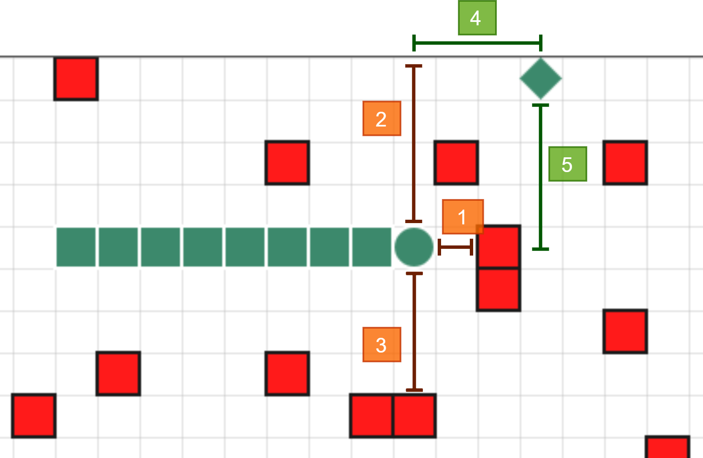

# Snake Evolver

[Demo](https://ppinto22.github.io/snake-evolver/)

## Inputs and Outputs

For every move, snakes' neural networks receive 5 inputs relative to the proximity of obstacles and the objective:

1. Obstacle proximity in the current direction. Range: 0 (far away) to 1 (close);
2. Obstacle proximity to the left. Range ]0, 1];
3. Obstacle proximity to the right. Range ]0, 1];
4. Objective proximity in the current (+) or opposite (-) directions. Range: -1 (far away in the opposite direction) -> 0 (close) -> +1 (far away in the current direction);
5. Objective proximity to the left (+) or right (-). Range ]-1, 1[.

There are 3 outputs - one for each possible move. The one with the highest activation is chosen.

1. Do not turn;
2. Turn left;
3. Turn right.

## Fitness

The fitness score is just the number of *diamonds* the snake collected.

## Technologies and Dependencies

- React, Typescript
- [Material UI](https://material-ui.com/) (React components), [Plotly](https://plotly.com/javascript/) (graphing)
- [Neataptic](https://github.com/wagenaartje/neataptic) (implementation of [NEAT](http://nn.cs.utexas.edu/downloads/papers/stanley.ec02.pdf), the neuroevolution algorithm)
